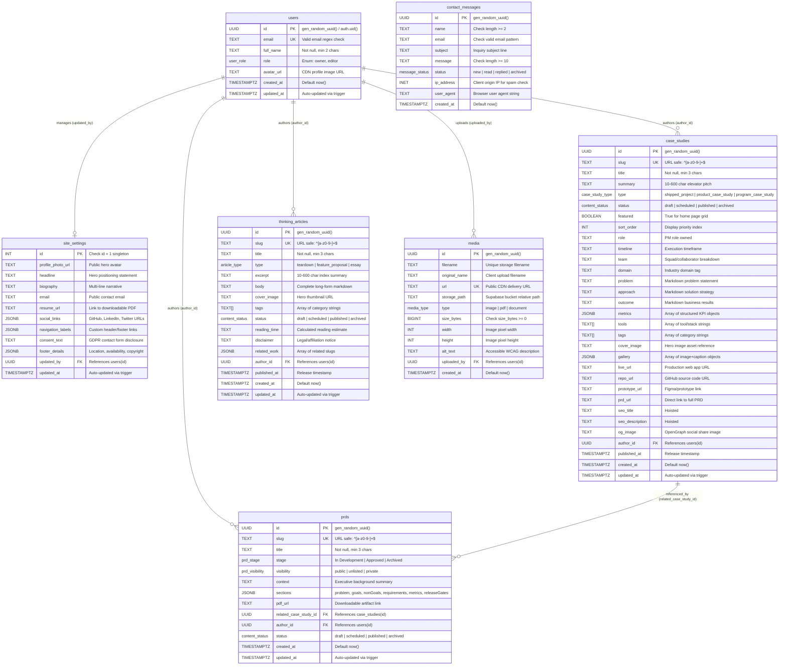

# Product Management Portfolio Platform — Entity-Relationship (ER) Diagram & Data Dictionary

**Architecture Status:** Production-Grade Specification per PRD Section 6 & 7  
**Database Engine:** Supabase PostgreSQL (Postgres 15+)  
**Security Layer:** Row-Level Security (`RLS`) + Domain Check Constraints + Custom Enumerations

---

## 1. Executive Architectural Summary

The data layer for the **Product Management Portfolio Platform** is engineered on **Supabase PostgreSQL** to provide strict relational data integrity, sub-millisecond filtering performance via GIN indexing, and military-grade access control via Row-Level Security (`RLS`).

### Key Architectural Pillars

- **Strict Domain Integrity:** Field validation (email format, slug formatting, string character limits, positive file sizes) is enforced natively inside PostgreSQL via `CHECK` constraints and `ENUM` types. Bad or incomplete data cannot enter the database even if API validation fails.
- **Unified Identity & Role Management:** The `users` table integrates with Supabase `auth.users` (`auth.uid()`) to authenticate requests. RLS policies inspect roles (`owner`, `editor`) dynamically to grant or restrict CRUD capabilities.
- **Singleton Configuration Pattern:** The `site_settings` table enforces `id = 1 CHECK (id = 1)`, guaranteeing that only one global configuration record can exist in the platform.
- **High-Performance Multi-Tag Filtering:** Array columns (`tags`, `tools`) and structured JSONB fields (`metrics`, `sections`, `gallery`) are indexed using **GIN (Generalized Inverted Index)** trees, allowing instant filtering across thousands of work items.

---

## 2. Entity-Relationship (`ER`) Diagram

The diagram below maps all 7 core entities, primary keys (`PK`), unique keys (`UK`), foreign keys (`FK`), and relational cardinalities across the platform.



---

## 3. Data Dictionary

### Table: `users`

Represents portfolio owners and editors authenticated via Supabase Auth or standalone sessions.

| Column       | Data Type     | Constraints & Defaults                          | Description                                               |
| :----------- | :------------ | :---------------------------------------------- | :-------------------------------------------------------- |
| `id`         | `UUID`        | `PK`, `DEFAULT gen_random_uuid()`               | Unique user identifier. Maps directly to `auth.users.id`. |
| `email`      | `TEXT`        | `UNIQUE`, `NOT NULL`, `CHECK (email ~* '^...')` | Verified email address.                                   |
| `full_name`  | `TEXT`        | `NOT NULL`, `CHECK (char_length >= 2)`          | Full display name shown in author credits.                |
| `role`       | `user_role`   | `NOT NULL`, `DEFAULT 'owner'`                   | Access tier (`owner` or `editor`).                        |
| `avatar_url` | `TEXT`        | `NULL`                                          | Profile avatar image URL.                                 |
| `created_at` | `TIMESTAMPTZ` | `NOT NULL`, `DEFAULT now()`                     | Record creation timestamp.                                |
| `updated_at` | `TIMESTAMPTZ` | `NOT NULL`, `DEFAULT now()`                     | Auto-updated via trigger `trg_users_updated_at`.          |

---

### Table: `site_settings`

Singleton configuration table controlling global branding, biography, navigation labels, and social links.

| Column              | Data Type     | Constraints & Defaults               | Description                                            |
| :------------------ | :------------ | :----------------------------------- | :----------------------------------------------------- |
| `id`                | `INT`         | `PK`, `DEFAULT 1`, `CHECK (id = 1)`  | Singleton enforcement: exactly 1 row (`id = 1`).       |
| `profile_photo_url` | `TEXT`        | `NULL`                               | Main hero profile image.                               |
| `headline`          | `TEXT`        | `NULL`                               | Primary hero positioning headline.                     |
| `biography`         | `TEXT`        | `NULL`                               | Executive multi-line biography narrative.              |
| `email`             | `TEXT`        | `CHECK (email ~* '^...')`            | Public contact email address.                          |
| `resume_url`        | `TEXT`        | `NULL`                               | URL pointing to downloadable resume PDF.               |
| `social_links`      | `JSONB`       | `NOT NULL`, `DEFAULT '{}'::jsonb`    | Map of social URLs (`github`, `linkedin`, `twitter`).  |
| `navigation_labels` | `JSONB`       | `NOT NULL`, `DEFAULT '{}'::jsonb`    | Custom display labels for site navigation.             |
| `consent_text`      | `TEXT`        | `NULL`                               | Privacy policy / GDPR consent string for contact form. |
| `footer_details`    | `JSONB`       | `NOT NULL`, `DEFAULT '{}'::jsonb`    | Map containing `location`, `status`, `copyright`.      |
| `updated_by`        | `UUID`        | `FK -> users(id) ON DELETE SET NULL` | Reference to last admin who modified settings.         |
| `updated_at`        | `TIMESTAMPTZ` | `NOT NULL`, `DEFAULT now()`          | Auto-updated via trigger.                              |

---

### Table: `case_studies`

Stores shipped engineering projects, product case studies, and program management deep dives.

| Column                      | Data Type         | Constraints & Defaults                                | Description                                                          |
| :-------------------------- | :---------------- | :---------------------------------------------------- | :------------------------------------------------------------------- |
| `id`                        | `UUID`            | `PK`, `DEFAULT gen_random_uuid()`                     | Unique case study identifier.                                        |
| `slug`                      | `TEXT`            | `UNIQUE`, `NOT NULL`, `CHECK (slug ~ '^[a-z0-9-]+$')` | URL-safe slug (`/work/[slug]`).                                      |
| `title`                     | `TEXT`            | `NOT NULL`, `CHECK (char_length >= 3)`                | Primary case study title.                                            |
| `summary`                   | `TEXT`            | `NOT NULL`, `CHECK (10 <= length <= 600)`             | Short elevator pitch shown on index cards.                           |
| `type`                      | `case_study_type` | `NOT NULL`                                            | Enum: `shipped_project`, `product_case_study`, `program_case_study`. |
| `status`                    | `content_status`  | `NOT NULL`, `DEFAULT 'draft'`                         | Publication lifecycle status.                                        |
| `featured`                  | `BOOLEAN`         | `NOT NULL`, `DEFAULT false`                           | Flag indicating prominence on Home page grid.                        |
| `sort_order`                | `INT`             | `NOT NULL`, `DEFAULT 0`                               | Explicit numerical sorting priority.                                 |
| `role`                      | `TEXT`            | `NULL`                                                | Exact product/engineering role owned.                                |
| `timeline`                  | `TEXT`            | `NULL`                                                | Execution start and end timeframe.                                   |
| `team`                      | `TEXT`            | `NULL`                                                | Collaborator and squad composition breakdown.                        |
| `domain`                    | `TEXT`            | `NULL`                                                | Industry or technical domain classification.                         |
| `problem`                   | `TEXT`            | `NULL`                                                | Markdown body of the core customer/technical problem.                |
| `approach`                  | `TEXT`            | `NULL`                                                | Markdown body of the solution architecture and decisions.            |
| `outcome`                   | `TEXT`            | `NULL`                                                | Markdown body of verified business impact and learnings.             |
| `metrics`                   | `JSONB`           | `NOT NULL`, `DEFAULT '[]'::jsonb`                     | Array of `{label, value, change, description, qualifier}`.           |
| `tools`                     | `TEXT[]`          | `NOT NULL`, `DEFAULT '{}'`                            | Array of technology stack and framework strings.                     |
| `tags`                      | `TEXT[]`          | `NOT NULL`, `DEFAULT '{}'`                            | Array of filtering categories (`FinOps`, `AI/ML`).                   |
| `cover_image`               | `TEXT`            | `NULL`                                                | Main card/hero thumbnail URL.                                        |
| `gallery`                   | `JSONB`           | `NOT NULL`, `DEFAULT '[]'::jsonb`                     | Array of `{url, caption}` for visual evidence.                       |
| `live_url`                  | `TEXT`            | `NULL`                                                | URL to deployed production application.                              |
| `repo_url`                  | `TEXT`            | `NULL`                                                | URL to GitHub source repository.                                     |
| `prototype_url`             | `TEXT`            | `NULL`                                                | URL to interactive Figma/design prototype.                           |
| `prd_url`                   | `TEXT`            | `NULL`                                                | Direct URL to full product requirement document.                     |
| `author_id`                 | `UUID`            | `FK -> users(id) ON DELETE SET NULL`                  | Reference to authoring user.                                         |
| `published_at`              | `TIMESTAMPTZ`     | `NULL`                                                | Timestamp when status changed to `published`.                        |
| `created_at` / `updated_at` | `TIMESTAMPTZ`     | `NOT NULL`, `DEFAULT now()`                           | Audit timestamps.                                                    |

---

### Table: `thinking_articles`

Stores product teardowns, feature proposals, and long-form technical product essays.

| Column                        | Data Type        | Constraints & Defaults                                | Description                                             |
| :---------------------------- | :--------------- | :---------------------------------------------------- | :------------------------------------------------------ |
| `id`                          | `UUID`           | `PK`, `DEFAULT gen_random_uuid()`                     | Unique article identifier.                              |
| `slug`                        | `TEXT`           | `UNIQUE`, `NOT NULL`, `CHECK (slug ~ '^[a-z0-9-]+$')` | URL-safe slug (`/thinking/[slug]`).                     |
| `title`                       | `TEXT`           | `NOT NULL`, `CHECK (char_length >= 3)`                | Article headline.                                       |
| `type`                        | `article_type`   | `NOT NULL`                                            | Enum: `teardown`, `feature_proposal`, `essay`.          |
| `excerpt`                     | `TEXT`           | `NOT NULL`, `CHECK (10 <= length <= 600)`             | Summary shown on index cards.                           |
| `body`                        | `TEXT`           | `NOT NULL`                                            | Full markdown essay content.                            |
| `cover_image`                 | `TEXT`           | `NULL`                                                | Hero thumbnail URL.                                     |
| `tags`                        | `TEXT[]`         | `NOT NULL`, `DEFAULT '{}'`                            | Array of category tags (`UX Strategy`, `Platform`).     |
| `status`                      | `content_status` | `NOT NULL`, `DEFAULT 'draft'`                         | Publication lifecycle status.                           |
| `reading_time`                | `TEXT`           | `NULL`                                                | Estimated reading duration (`5 min read`).              |
| `disclaimer`                  | `TEXT`           | `NULL`                                                | Legal disclaimer (e.g., non-affiliation with WhatsApp). |
| `related_work`                | `JSONB`          | `NOT NULL`, `DEFAULT '[]'::jsonb`                     | Array of related work item slugs.                       |
| `author_id`                   | `UUID`           | `FK -> users(id) ON DELETE SET NULL`                  | Reference to authoring user.                            |
| `published_at` / `created_at` | `TIMESTAMPTZ`    | `NOT NULL` / `NULL`                                   | Release and creation timestamps.                        |

---

### Table: `prds`

Stores structured Product Requirement Documents complete with problem statements, requirements matrices, and launch gates.

| Column                  | Data Type        | Constraints & Defaults                                | Description                                                                                             |
| :---------------------- | :--------------- | :---------------------------------------------------- | :------------------------------------------------------------------------------------------------------ |
| `id`                    | `UUID`           | `PK`, `DEFAULT gen_random_uuid()`                     | Unique PRD identifier.                                                                                  |
| `slug`                  | `TEXT`           | `UNIQUE`, `NOT NULL`, `CHECK (slug ~ '^[a-z0-9-]+$')` | URL-safe slug (`/prds/[slug]`).                                                                         |
| `title`                 | `TEXT`           | `NOT NULL`, `CHECK (char_length >= 3)`                | Full PRD specification title.                                                                           |
| `stage`                 | `prd_stage`      | `NOT NULL`, `DEFAULT 'In Development'`                | Engineering stage (`In Development`, `Approved`, `Archived`).                                           |
| `visibility`            | `prd_visibility` | `NOT NULL`, `DEFAULT 'public'`                        | Access level (`public`, `unlisted`, `private`).                                                         |
| `context`               | `TEXT`           | `NOT NULL`                                            | Executive background and problem context.                                                               |
| `sections`              | `JSONB`          | `NOT NULL`, `DEFAULT '{}'::jsonb`                     | Structured object containing `problem`, `goals`, `nonGoals`, `requirements`, `metrics`, `releaseGates`. |
| `pdf_url`               | `TEXT`           | `NULL`                                                | Link to downloadable PDF artifact.                                                                      |
| `related_case_study_id` | `UUID`           | `FK -> case_studies(id) ON DELETE SET NULL`           | Optional linkage to the shipped case study.                                                             |
| `author_id`             | `UUID`           | `FK -> users(id) ON DELETE SET NULL`                  | Reference to authoring user.                                                                            |
| `status`                | `content_status` | `NOT NULL`, `DEFAULT 'draft'`                         | Publication lifecycle status.                                                                           |

---

### Table: `media`

Tracks all uploaded images, diagrams, and PDF files stored in Supabase Storage.

| Column             | Data Type     | Constraints & Defaults                | Description                                                  |
| :----------------- | :------------ | :------------------------------------ | :----------------------------------------------------------- |
| `id`               | `UUID`        | `PK`, `DEFAULT gen_random_uuid()`     | Unique asset identifier.                                     |
| `filename`         | `TEXT`        | `NOT NULL`                            | Unique storage object filename.                              |
| `original_name`    | `TEXT`        | `NOT NULL`                            | Original client upload filename.                             |
| `url`              | `TEXT`        | `UNIQUE`, `NOT NULL`                  | Public CDN access URL.                                       |
| `storage_path`     | `TEXT`        | `NOT NULL`                            | Internal bucket storage path (`portfolio-media/images/...`). |
| `type`             | `media_type`  | `NOT NULL`                            | Enum (`image`, `pdf`, `document`).                           |
| `size_bytes`       | `BIGINT`      | `NOT NULL`, `CHECK (size_bytes >= 0)` | File size in bytes.                                          |
| `width` / `height` | `INT`         | `CHECK (> 0)`                         | Optional pixel dimensions for image assets.                  |
| `alt_text`         | `TEXT`        | `NULL`                                | Accessible WCAG screen-reader description.                   |
| `uploaded_by`      | `UUID`        | `FK -> users(id) ON DELETE SET NULL`  | Reference to uploading user.                                 |
| `created_at`       | `TIMESTAMPTZ` | `NOT NULL`, `DEFAULT now()`           | Upload timestamp.                                            |

---

### Table: `contact_messages`

Stores public inquiries submitted via the site's contact form.

| Column       | Data Type        | Constraints & Defaults                  | Description                                                     |
| :----------- | :--------------- | :-------------------------------------- | :-------------------------------------------------------------- |
| `id`         | `UUID`           | `PK`, `DEFAULT gen_random_uuid()`       | Unique message identifier.                                      |
| `name`       | `TEXT`           | `NOT NULL`, `CHECK (char_length >= 2)`  | Sender display name.                                            |
| `email`      | `TEXT`           | `NOT NULL`, `CHECK (email ~* '^...')`   | Sender contact email address.                                   |
| `subject`    | `TEXT`           | `NOT NULL`, `DEFAULT 'General Inquiry'` | Inquiry subject line.                                           |
| `message`    | `TEXT`           | `NOT NULL`, `CHECK (char_length >= 10)` | Full inquiry text body.                                         |
| `status`     | `message_status` | `NOT NULL`, `DEFAULT 'new'`             | Inbox processing status (`new`, `read`, `replied`, `archived`). |
| `ip_address` | `INET`           | `NULL`                                  | Sender origin IP for spam/rate-limiting verification.           |
| `user_agent` | `TEXT`           | `NULL`                                  | Client browser agent string.                                    |
| `created_at` | `TIMESTAMPTZ`    | `NOT NULL`, `DEFAULT now()`             | Submission timestamp.                                           |

---

## 4. Custom Enumerations Reference

```sql
CREATE TYPE case_study_type AS ENUM ('shipped_project', 'product_case_study', 'program_case_study');
CREATE TYPE content_status AS ENUM ('draft', 'scheduled', 'published', 'archived');
CREATE TYPE article_type AS ENUM ('teardown', 'feature_proposal', 'essay');
CREATE TYPE prd_stage AS ENUM ('In Development', 'Approved', 'Archived');
CREATE TYPE prd_visibility AS ENUM ('public', 'unlisted', 'private');
CREATE TYPE media_type AS ENUM ('image', 'pdf', 'document');
CREATE TYPE message_status AS ENUM ('new', 'read', 'replied', 'archived');
CREATE TYPE user_role AS ENUM ('owner', 'editor');
```

---

## 5. Row-Level Security (`RLS`) Access Matrix

Every table has `ENABLE ROW LEVEL SECURITY` enforced. Access is governed by whether the request is anonymous (`anon` role / public visitor) or authenticated as an owner/editor (`is_admin()` function).

| Table                   | Public (`anon` / `authenticated`) Read                                   | Public (`anon`) Write                   | Admin (`owner` / `editor`) Access              |
| :---------------------- | :----------------------------------------------------------------------- | :-------------------------------------- | :--------------------------------------------- |
| **`users`**             | `SELECT` allowed (public profile info).                                  | Blocked (`403 Forbidden`).              | Full `ALL` (`SELECT, INSERT, UPDATE, DELETE`). |
| **`site_settings`**     | `SELECT` allowed (`id = 1`).                                             | Blocked (`403 Forbidden`).              | Full `ALL` (`SELECT, INSERT, UPDATE, DELETE`). |
| **`case_studies`**      | `SELECT` allowed `WHERE status = 'published'`.                           | Blocked (`403 Forbidden`).              | Full `ALL` (`SELECT, INSERT, UPDATE, DELETE`). |
| **`thinking_articles`** | `SELECT` allowed `WHERE status = 'published'`.                           | Blocked (`403 Forbidden`).              | Full `ALL` (`SELECT, INSERT, UPDATE, DELETE`). |
| **`prds`**              | `SELECT` allowed `WHERE status = 'published' AND visibility = 'public'`. | Blocked (`403 Forbidden`).              | Full `ALL` (`SELECT, INSERT, UPDATE, DELETE`). |
| **`media`**             | `SELECT` allowed (`true` for CDN display).                               | Blocked (`403 Forbidden`).              | Full `ALL` (`SELECT, INSERT, UPDATE, DELETE`). |
| **`contact_messages`**  | Blocked (`403 Forbidden`).                                               | `INSERT` allowed (`WITH CHECK (true)`). | Full `ALL` (`SELECT, UPDATE status, DELETE`).  |
